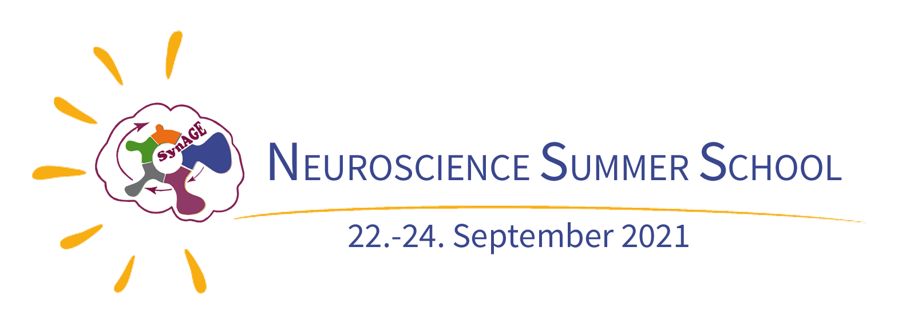

# A primer on ML/DL with a focus on Neuroscience

Throughout the last couple of years, ML and DL become expotentially more and more prominent within the majority of 
research fields. Neuroscience is no exception to that, as things like personalized medicine, image/data processing and 
the combination of biological and artifical neural networks are treated as central research questions. However, what's
actually behind all these buzzwords? Is ML and DL really necessary in the majority of cases? Can they acutally applied
to any kind of data and help solve distinct problems? Within this workshop which was organized as part of the [SynAGE 2021 summer school](https://www.synage.de/synage-summer-school/),
we will introduce and discuss important aspects of these methods and evaluate their usability, as well as potential application to research
projects of the attendees. While the first, rather theoretical part will be publicly shared here, the application focused part won't as this
will include datasets of the attendees.    

## "What's in this repository?"

This repository contains the basic skeleton for workshop, as well as most of the utilzied materials, including slides and jupyter notebooks.

We've tried to document the various aspects  with a whole bunch of README files, so feel free to jump around and check things out.

The general idea was to generate one overarching and interactive resource, allowing attendees and other interested folks to follow the slides and play
around with the various tutorials tutorials and go through things in their own pace, potentially before and after the workshop. 
Overall, the content is divided into three sections:

- [Outline, Overview, Setup and general questions]()
- [Prerequisites]() 
- ["Classic" ML]()
- [DL]()
- [Feedback]()

For everything else and specific information regarding the sections, please consult the [rendered jupyter book]().

## "I have some questions..."

[Open an issue]() on this repository and someone will try and get back to you as soon as possible!

## Acknowledgements

This workshop was organized by the students of the [RTG 2413 SynAGE](https://www.synage.de/), as part of its [2021 summer school](https://www.synage.de/synage-summer-school/).

The summer school itself was funded by the Deutsche Forschungsgemeinschaft (DFG).

